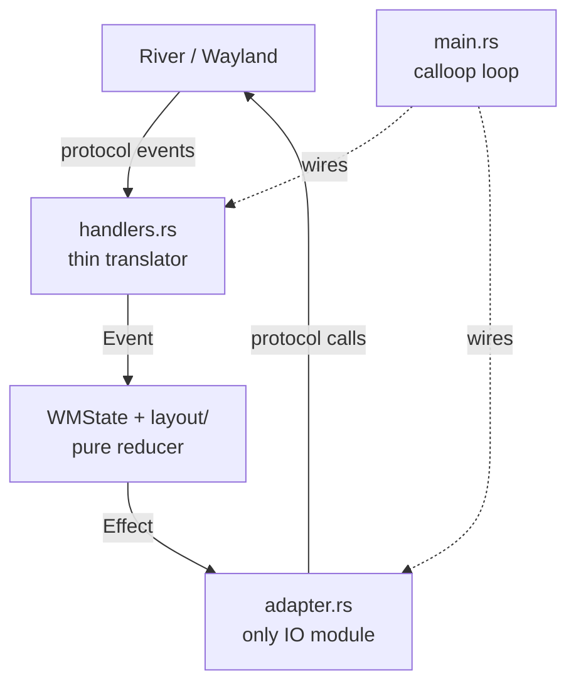

# ADR 0001: Hexagonal Architecture

## Status

Accepted.

## Context

Fenestre must run its core tiling/layout logic without a live River compositor so
that it can be unit-tested in isolation. It also must keep protocol concerns
(windows, outputs, seats, keybindings) confined so that Wayland/River changes do
not ripple through the decision logic.

## Decision

Split `src/state/` into three layers:

- **Core (pure):** `WMState` (`src/state/wm.rs`) and the layout engine
  (`src/layout/`), plus the scene reconciler (`src/state/scene.rs`). They know
  nothing about River/Wayland. The single entry point is
  `WMState::handle_event(Event)`, a pure reducer over the domain `Event` enum
  (`src/state/events.rs`). It performs no protocol I/O.
- **Adapter (IO):** `src/state/adapter.rs` is the **only** `state/` module that
  imports `protocol::` and issues River calls. It applies deferred `Effect`s and
  owns proxy bookkeeping for windows/outputs/seats.
- **Runtime:** `main.rs` owns the `calloop` loop and wires the adapter to the core.

The boundary types are:

- `Event` (`src/state/events.rs`) — pure inputs translated from River protocol
  events by `handlers.rs`.
- `Effect` (`src/state/effects.rs`) — deferred window-level River protocol calls.

`handlers.rs` is a thin translator only: River event → `Event`, and
`Effect` → adapter. No state mutation happens in `handlers.rs`.

## Consequences

- The core is testable without a compositor.
- Protocol-only breakage is isolated to the adapter.
- Invariant 1 in `architecture.md` (Hexagonal boundary) is compiler-enforced for
  the core: `state/wm.rs`, `state/scene.rs`, and `layout/` contain no
  `protocol::` imports and no River calls.
