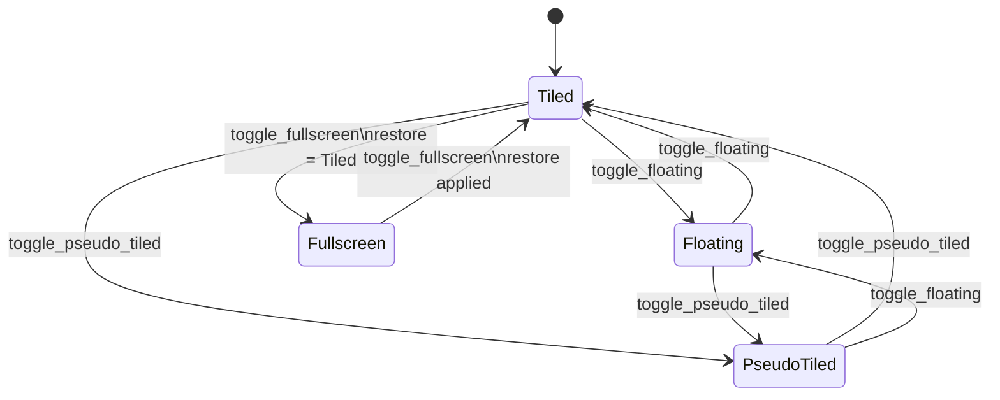

# ADR 0003: WindowState as Enum-with-Data

## Status

Accepted.

## Context

A window can be tiled, floating, pseudo-tiled, or fullscreen, and some of those
modes carry their own geometry. Representing these as separate boolean flags and
optional rect fields invites illegal combinations (e.g. a "tiled" window that also
holds a floating rect, or a fullscreen window that has lost its prior state).

## Decision

Window state is a single **enum-with-data** living on the layout tree node
(`src/layout/tree.rs`) so illegal states are unrepresentable:

- `Tiled`
- `Floating { rect: Rect }`
- `PseudoTiled { rect: Rect }`
- `Fullscreen { restore: Box<WindowState> }`

The tree node owns this **single** typed state. `Floating`/`PseudoTiled` carry
their own rect, so a tiled window *cannot* hold a floating rect, and `Fullscreen`
carries the pre-fullscreen state in `restore`. Toggle transitions
(`toggle_fullscreen` / `toggle_floating` / `toggle_pseudo_tiled`) are total,
derived from the variant via `mem::replace`.

Non-tiling windows (floating/fullscreen) receive zero-area rects so they do not
consume split space. `arranged_windows_readonly` returns
`(window_id, rect, WindowState)` for the reconciler.

Every toggle is total: it is derived from the current variant via `mem::replace`,
so `Fullscreen.restore` always carries the exact prior state to return to.

## Consequences

- The compiler prevents constructing an inconsistent window state.
- `WindowState` is the single window-state vocabulary: the authoritative state
  lives on the layout tree node and is mirrored into the reconciler's scene
  snapshots (`last_manage_scene` / `last_render_scene`), as noted in the
  Configuration section of `architecture.md`.
